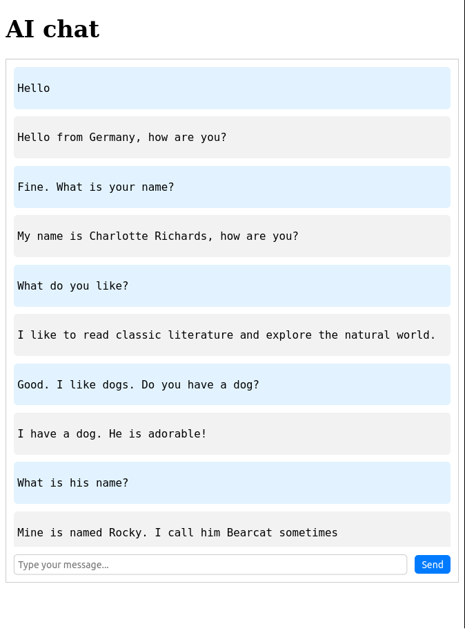

Chat AI bot using "microsoft/GODEL-v1_1-large-seq2seq" as the ML model, FastApi as the backend and vue.js as the frontend.



Run server

```sh
make serve
```

Tags: python, chatbot, machine learning, fastapi, transformers, vue.js
